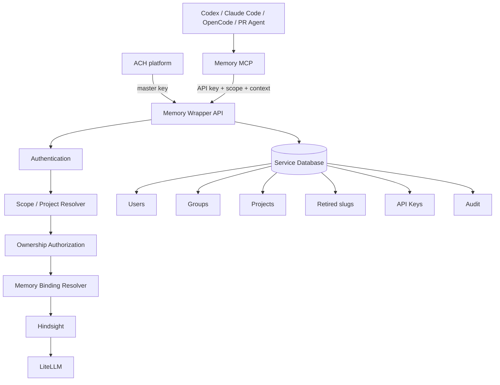

# Memory Service for Coding Agents — SPEC v1

**Status:** Draft for SDD revalidation
**Date:** 2026-08-22 (rev. 6 — write rate limiting and MCP input-validation error codes closed into §18)
**Scope:** v1 / YAGNI
**Implementation preference:** Python
**Backend:** Hindsight (MIT, self-hosted)
**Interface:** API + MCP only
**UI:** Out of scope

---

## 0. Revision history and settled decisions

Rev. 1 predated any measurement of Hindsight's surface. Rev. 2 measured it.
Rev. 3 merged two parallel rev. 2 drafts. Rev. 4 clarified identity,
provisioning and the mental-model boundary. Rev. 5 fixes project-identity
derivation, makes renames non-destructive, and adds the two things every prior
revision omitted: a cost guardrail and a content-level threat model. Rev. 6
codifies two closed-list additions to §18 that landed in code without a
matching revision bump at the time — `RATE_LIMITED` (Plan 4's write limiter)
and `INVALID_REQUEST` (the MCP tool-input validation boundary) — recorded here
retroactively by the Plan 4 final review.

Everything below is settled unless explicitly listed in §25.

| # | Decision | Section |
|---|----------|---------|
| 1 | Hindsight self-hosted via Helm in k8s next to LiteLLM; models reached with one LiteLLM API key | §19.3 |
| 2 | Our tenant is a DB-only concept; Hindsight's `{tenant}` path segment is always the literal `default` | §19.1 |
| 3 | Mono-tenant in v1; tenant columns/path remain so multi-tenancy is not a data-model rewrite | §4.1 |
| 4 | `scope` is a parameter on every MCP memory tool | §11.1 |
| 5 | `retain` is asynchronous; `get_operation` / `list_operations` / `cancel_operation` are distinct MCP tools | §15 |
| 6 | **Zero retrieval tags.** Runtime context is provenance metadata | §13.6 |
| 7 | The MCP surface is intentionally narrow; Hindsight bank/config/governance APIs are not blindly mirrored | §11 |
| 8 | Directives and mental-model management are API-only, never LLM-callable through MCP | §14 |
| 9 | v1 defines no automatic mental-model bootstrap, predefined model, or creation-timing policy | §14.3 |
| 10 | `document_id` is caller-managed and never namespaced by user or agent | §11.4 |
| 11 | `forget` is invalidation, not physical deletion; `restore` reverses it | §12 |
| 12 | `clear_memories` and `delete_bank` are admin API only | §12, §16.4 |
| 13 | Delegated master-key calls acting for a human carry `on_behalf_of` | §5.2 |
| 14 | The public project identity is `project_slug`; there is no public `project_id` in v1 | §4.4, §8 |
| 15 | MCP project resolution is `MEMORY_PROJECT` → Git-derived slug → error | §8, §10 |
| 16 | Git locator is project metadata only; it is not identity and is not authorization evidence | §4.4, §8.3 |
| 17 | The same service supports standalone and ACH-driven provisioning; there is no deployment mode switch | §16.5 |
| 18 | The bootstrap master key is supplied as a configured hash; it is not created through the API | §5.2 |
| 19 | Bank IDs are allocated when the user/project row is created and materialized in Hindsight on first use | §4.2, §19.2 |
| 20 | Knowing a secondary object ID never grants access; IDs resolve only inside an already-authorized bank | §7, §20 |
| 21 | **A Git-derived slug flattens the whole locator, not the repository basename** | §8.2 |
| 22 | **A renamed slug leaves a forwarding tombstone; resolution follows it instead of creating a new project** | §8.6 |
| 23 | **Any caller authorized for a project may rename it and transfer its ownership** | §6.1, §8.5 |
| 24 | **No wrapper-side refresh default: Hindsight's own trigger defaults mean no automatic refresh at all** | §14.5 |
| 25 | **No bank tuning in v1. Hindsight's stock config is used as-is, including `enable_auto_consolidation=true`. `ensure_bank` sets no fields at all (Plan 6 Task 1)** | §19.5 |
| 26 | **`RATE_LIMITED` and `INVALID_REQUEST` are closed-list §18 error codes** (write-rate quota; MCP tool-input validation) | §18, §20 |

Historical reversal retained for reviewers: an earlier rev. 2 proposed mirroring
Hindsight's full MCP surface including mental-model writes. That remains
superseded — v1 exposes mental models over REST only, and whether a coding
workflow should create one is deferred to usage experimentation.

Second reversal, rev. 5: rev. 4 introduced `PROJECT_RENAMED` as a hard error.
It is now a **response annotation on a successful forwarded resolution** (§8.6).
A hard error would break every Git-auto-detecting agent on the first rename —
which, given decision 21, is exactly the operation people will perform most.

---

## 1. Purpose

A thin memory service on top of Hindsight for coding agents and autonomous
development agents — Codex, Claude Code, OpenCode, PR reviewers, CI agents.

It provides:

- isolated user memory;
- isolated/shared project memory;
- explicit ownership;
- safe multi-user access;
- project auto-resolution for coding agents;
- explicit project resolution for non-interactive agents;
- a stable MCP/API contract independent from Hindsight bank naming;
- a master API key for administrative and delegated access;
- provenance enrichment from the MCP/runtime.

It is deliberately small: no general RBAC, no per-memory ACLs, no UI, no
multiple banks per project.

The service is usable **standalone** and can simultaneously be provisioned by
platform clients such as ACH through the same API. ACH is not a runtime
dependency (§16.5).

---

## 2. Design principles

### 2.1 YAGNI

v1 has: two memory scopes (`user`, `project`); two owner types (`user`,
`group`); two credential types (user key, master key); one bank per user; one
bank per project; no RBAC; no per-memory ACLs; no per-agent memory scope; no
UI.

### 2.2 Hindsight is an implementation detail

Clients never see or supply a Hindsight `bank_id`. The service owns the mapping
between logical memory resources and banks. `list_banks` and `create_bank` are
not exposed (§11.7).

The only public identifiers needed for normal memory work are the authenticated
user identity and the project's public `project_slug`.

### 2.3 Identity and authorization are server-side

The MCP/runtime supplies project context and provenance. It must never grant
itself access by changing a user identifier, a project slug, agent/source
metadata, or a memory/document/operation identifier.

All authorization is evaluated by the wrapper from the authenticated credential
and the resolved logical bank.

### 2.4 Project is the generic domain concept

The domain concept is `Project`, not `Repository`. A project has one public
identifier in v1:

```text
project_slug
```

For coding agents the slug is **derived from the full Git locator** (§8.2). For
non-interactive agents it is supplied explicitly through `MEMORY_PROJECT`.

There is no separate public `project_id` in v1. An implementation may keep an
internal database UUID; it is not part of the API contract.

### 2.5 One project, one memory

A project has exactly one Hindsight bank. No private overlays, no per-user
project banks, no per-agent banks, no `agent::project` banks.

Codex, OpenCode, Claude Code and PR reviewers use the same project bank when
authorized.

`agent` is provenance — not a memory scope and not an authorization dimension.

### 2.6 Narrow the surface by capability

Where a Hindsight capability is exposed, the wrapper preserves its semantics
with `bank_id` replaced by `scope` plus server-side project resolution.

A capability is MCP-visible only when it is normal agent memory work.
Governance and configuration stay API-only. How the Hindsight adapter is
implemented internally — generic proxy, typed functions, generated client — is
an implementation decision. The architectural requirement is that
authentication, scope resolution, authorization and bank resolution are
centralized and cannot be bypassed.

---

## 3. High-level architecture



The MCP is a stateless client adapter. The wrapper API is the security and
domain boundary. Hindsight is the memory engine. LiteLLM serves the models
Hindsight uses for extraction, consolidation and reflection.

---

## 4. Core concepts

### 4.1 Tenant

One organization/company/workspace. All identities and resources are scoped to
a tenant in our own database. The Hindsight `{tenant}` path segment is a
separate, fixed value (see §19.1) — it does not vary with our `tenant_id`:

```text
tenant_id = ten_acme   ->   /v1/default/banks/...
```

**v1 is mono-tenant.** The column and Hindsight path segment are still always
populated. Cross-tenant resolution logic and a cross-tenant test matrix are
deferred.

### 4.2 User

An authenticated human principal. A user may own projects, belong to groups and
hold API keys.

When a user is created the service allocates the bank ID immediately:

```text
User
  id: usr_...
  tenant_id: ten_acme
  bank_id: user_<uuid>
```

The bank ID is persisted locally; no Hindsight bank is materialized yet.
Hindsight auto-creates it on the first real memory operation (§19.2).

A master-key caller may supply the user ID explicitly — for example an ACH user
ID. If omitted, the service generates one.

### 4.3 Group

A collection of users that may own projects. No roles exist inside a group in
v1. Every member of an owning group has the same access to the project's memory
and governance API.

```text
group_id = grp_platform
```

As with users, master-key provisioning may supply a group ID or let the service
generate one.

### 4.4 Project

The generic unit of shared work and shared project memory. Its public identity
is the mutable, tenant-unique `project_slug`:

```text
Project
  internal_id: <DB UUID, internal only>
  tenant_id: ten_acme
  project_slug: github-com-acme-payments-api
  owner_type: group
  owner_id: grp_payments
  bank_id: project_<uuid>
  git_locator: github.com/acme/payments-api   optional metadata
```

Rules:

- `project_slug` is the only project identifier used by ordinary API/MCP
  clients;
- `UNIQUE(tenant_id, project_slug)`;
- `project_slug` may be renamed, and a rename leaves a forwarding tombstone
  (§8.6);
- `bank_id` never changes when the slug changes;
- an internal DB UUID may exist but is not part of the public contract;
- `git_locator` is informational metadata: not unique, not authorization
  evidence, and not used to resolve identity;
- but a **mismatched** stored locator does block an ambiguous explicit
  resolution (§8.4).

No separate display name exists in v1. Add one later only if a real UI or
product need appears.

### 4.5 Memory scope

Exactly two: `user`, `project`. No `agent` scope. The agent/runtime is
provenance.

### 4.6 Logical memory key

A human-readable key for logs, metrics and debugging:

```text
{tenant_id}::{scope}::{logical_id}

ten_acme::user::usr_123
ten_acme::project::github-com-acme-payments-api
```

For projects this key changes on rename. That is acceptable because it is not
storage identity — the Hindsight bank ID is stable.

### 4.7 Hindsight bank ID

Opaque and immutable. Recommended internal forms:

```text
user_<uuid>
project_<uuid>
```

The prefix may expose the logical bank type for diagnostics, but the identifier
must never encode tenant name, user name, project slug, repository name or
agent name.

Hindsight banks auto-create on first use, so the wrapper allocates and persists
the bank ID first and lets the first Hindsight operation materialize the bank.

---

## 5. Credentials

### 5.1 User API key

Resolves to `tenant_id` + `user_id`. The client never sends a user ID to
identify itself.

```text
Authorization: Bearer mem_...
```

It grants access to:

- the authenticated user's `user` memory;
- projects owned by that user;
- projects owned by groups that contain that user.

### 5.2 Master API key

The bootstrap master key is configured at service startup as a hash, in the
same spirit as a LiteLLM master-key configuration:

```text
MEMORY_MASTER_KEY_HASH=<hash>
```

The plaintext master secret is never stored in the service database.

A master key resolves to `tenant_id` and may access or provision any resource
inside that tenant. It is used for bootstrap/provisioning, administration,
migration, repair and platform integrations such as ACH.

A master-key request acting on behalf of a human supplies:

```text
on_behalf_of: <user_id>
```

This is audit and provenance context, never authorization evidence. A purely
administrative master-key action may omit it; the actor is then recorded as the
master credential itself.

The master key must never be configured in an ordinary coding-agent or other
untrusted LLM runtime.

### 5.3 Provisioned user keys

User API keys are created and revoked through the API. The service stores only
a secure hash of each generated key and returns the plaintext secret only at
creation time.

A master-key caller may create a user with either an explicit ID
(ACH/platform provisioning) or a generated one (standalone provisioning). Both
forms coexist in the same deployment; there is no mode switch.

---

## 6. Ownership model

A project has exactly one owner: one user or one group.

- `owner_type = user` → only that user may access the project memory.
- `owner_type = group` → any member of that group may.

### 6.1 Ownership change

Sharing is modeled as ownership transfer. There is no `share` primitive in v1.

```text
change_owner(project_slug, owner_type, owner_id)

user:juan      -> group:platform
user:juan      -> user:alice
group:platform -> user:bob
group:platform -> group:payments
```

**Authorization in v1: any caller authorized for the project may transfer it.**

```text
allow iff caller is authorized for the project (§7)
         or caller holds the master key
```

Transferring from one user to another removes the previous owner's access
unless it is regained through the new owning group.

**Accepted consequence.** Because every group member is authorized, any single
group member may transfer a group-owned project to themselves and lock the rest
of the group out. v1 accepts this deliberately: the alternative is a group-admin
role, which is a permission model, and v1 has none (§22). The transfer is
recorded as an audit event (§20) and is reversible by the new owner or by the
master key. Revisit if it ever actually happens.

---

## 7. Authorization rules

```text
user key:
    if project.owner_type == "user":
        allow iff authenticated_user.id == project.owner_id

    if project.owner_type == "group":
        allow iff authenticated_user is a member of project.owner_id

master key:
    allow for any resource inside its tenant
```

The same bank-level authorization applies to the data plane and to the API-only
governance surface. In v1 there is no separate `governor`, `writer` or `admin`
permission.

So if Alice belongs to the group owning `github-com-acme-payments-api`:

```text
Alice via MCP:   retain / recall / reflect / curation / documents  -> allowed
Alice via REST:  mental-model and directive management             -> allowed
Alice via REST:  rename, ownership transfer                        -> allowed
```

The difference between MCP and REST is capability exposure to the model, not
RBAC.

Project slugs, Git locators, provenance metadata and object IDs are never
authorization evidence.

Every secondary resource ID is resolved only after the caller's logical bank has
been resolved and authorized:

```text
credential
  -> scope
  -> user/project bank
  -> authorize
  -> memory/document/operation/mental-model/directive ID
```

Possession of a secondary ID never grants access (§20).

---

## 8. Project resolution

```text
1. MEMORY_PROJECT
2. Git-derived slug
3. PROJECT_CONTEXT_UNAVAILABLE
```

There is no `MEMORY_PROJECT_ID` and no `MEMORY_PROJECT_NAME` in v1.

Resolution of a slug — from either source — first consults live projects, then
retired slugs (§8.6):

```text
slug
  -> active project?          yes -> authorize, use it
  -> retired slug?            yes -> forward to current slug, annotate response
  -> neither, user credential -> create (§8.1)
```

### 8.1 Explicit project slug

```bash
MEMORY_PROJECT=payments-api
```

The MCP sends the normalized slug with every project-scoped request. The
wrapper resolves `tenant_id + project_slug`.

If the project exists: load it, authorize the caller, resolve its internal bank
ID, execute.

If it does not exist and the caller is a user credential: create the project,
`owner = authenticated user`, allocate `project_<uuid>`, persist, execute.

A master-key caller may also create a project through the Project API,
supplying the intended owner explicitly (§16.2).

### 8.2 Git-derived slug

If `MEMORY_PROJECT` is absent, the MCP derives a slug from the current Git
repository. **The derivation flattens the whole locator, not the repository
basename:**

```text
cwd
  -> Git repository/worktree root
  -> origin remote URL
  -> canonical locator     github.com/acme/payments-api
  -> derived slug          github.com-acme-payments-api-dab6719d
```

```text
git@github.com:acme/payments-api.git       -> github.com-acme-payments-api-dab6719d
https://github.com/acme/payments-api.git   -> github.com-acme-payments-api-dab6719d
https://gitlab.com/customer/payments-api   -> gitlab.com-customer-payments-api-bc401689
```

**The trailing digest is required, not decoration.** Slug normalization
collapses `/`, `.` and `-` to a single separator, so flattening ALONE still
collides:

```text
github.com/acme/payments-api   -> github.com-acme-payments-api   \
                                                                  } same slug
github.com/acme-payments/api   -> github.com-acme-payments-api   /
```

Two unrelated repositories sharing one memory bank is precisely the failure
this section exists to prevent, so a derived slug MUST carry a short digest of
the CANONICAL locator (host kept; scheme, userinfo, port and a trailing `.git`
removed; lowercased). Taking it over the canonical form is what makes the same
repository yield the same slug however its remote is spelled -- the first two
examples above differ only in transport and still agree.

Deriving the slug is the CLIENT's job (§10). This service normalizes and
stores whatever slug it is given; it never derives one.

The locator is also stored as `git_locator` metadata (§8.3).

**Why the whole locator.** A basename-derived slug collides constantly —
`api`, `backend`, `infra`, `docs`, `common`, `website` are the same word in
dozens of unrelated repositories. Two unrelated repositories resolving to one
slug means one shared memory bank, and under first-toucher ownership (§8.5) the
second team receives `PROJECT_ACCESS_DENIED` for a project that is not theirs,
with no way to tell it apart. Flattening the locator removes the collision at
the root instead of documenting it as acceptable.

The resulting slug is ugly, which is expected: **renaming to something readable
is a normal first-day operation**, which is exactly why §8.6 exists.

If Git context cannot be resolved: `PROJECT_CONTEXT_UNAVAILABLE`.

### 8.3 Git locator enrichment

When resolution finds an existing project:

```text
if caller is authorized
and project.git_locator is null
and a locator is available:
    the wrapper may populate git_locator
```

If the caller is not authorized, no project property is mutated. `git_locator`
remains informational and an authorized caller may update it through the
Project API.

### 8.4 Locator mismatch

Slug derivation removes accidental collisions, but an explicit
`MEMORY_PROJECT` can still point a second repository at an existing project.

```text
if the resolved project has a non-null git_locator
and the caller presents a different non-null locator:
    -> PROJECT_LOCATOR_MISMATCH
```

The request is refused rather than silently merging two repositories into one
memory. Recovery is explicit: clear or update the stored locator through the
Project API, or use a different slug. A caller presenting no locator (a PR
agent with no checkout) is unaffected.

### 8.5 First-toucher ownership

Lazy creation means the first authenticated user to touch a new slug owns it.
Every other user receives:

```text
PROJECT_ACCESS_DENIED
```

until ownership is transferred to them or to a group containing them. Because
§6.1 now allows any authorized caller to transfer, recovery no longer requires
the master key once the requester has been let in once.

For UX the error returns `project_slug` and `owner_type`, and **not** the owner
user/group ID. This intentionally reveals the existence and ownership kind of a
same-tenant project in exchange for a much clearer recovery path.

Project renaming follows the same rule as every other project mutation: any
caller authorized for the project may do it (§7).

### 8.6 Rename and forwarding tombstones

`project_slug` is mutable:

```http
PATCH /v1/projects/github-com-acme-payments-api
{ "project_slug": "payments-api" }
```

The operation changes the public slug and its normalized index only. It does
not change the internal DB identity, `bank_id`, ownership, memories, documents,
mental models or directives.

**A rename retires the old slug into a forwarding tombstone.**

```text
RetiredSlug(tenant_id, retired_slug -> project.internal_id)
```

Resolution of a retired slug **succeeds**, forwards to the project, and
annotates the response:

```json
{
  "project_slug": "payments-api",
  "resolved_from": "github-com-acme-payments-api",
  "notice": "PROJECT_RENAMED"
}
```

**Why forwarding and not an error.** Under §8.2 the derived slug is ugly, so
renaming is the common case, and after a rename Git auto-detection keeps
deriving the old slug on every agent start. If the old slug merely errored,
every agent that does not pin `MEMORY_PROJECT` would break on the first rename.
If the old slug were simply free again, the next agent would **silently create a
new empty project** — a failure that looks like success and reads to the user as
"the memory forgot everything". Forwarding is the only option that fails
neither way.

**Chained renames.** A tombstone stores the project's `internal_id`, not its
slug, and renaming never changes `internal_id` — it only mutates
`project_slug` on the same row. So no existing tombstone is ever rewritten:
every tombstone already points at the row, and following it lands on the
row's current slug, whatever that is. Resolution is therefore always a single
hop: no transitive walk, no cycles, and nothing to keep in sync.

```text
rename A -> B :  tombstone A -> project (internal_id unchanged)
rename B -> C :  tombstone A unchanged, tombstone B added, both -> project
```

A retired slug is never available for a new project while its tombstone exists.
Reclaiming one is an explicit admin action.

There are no aliases in v1: a tombstone forwards, it is not a second live name.

---

## 9. Project creation race

Two users may discover the same new slug concurrently. The database enforces:

```text
UNIQUE(tenant_id, project_slug)
```

No distributed lock is required.

```text
Juan                              Alice
lookup slug -> none               lookup slug -> none
create                            create
success                           uniqueness conflict
owner = Juan                      reload existing project
                                  authorize Alice
                                  denied unless authorized
```

The uniqueness winner owns the initial project. `git_locator` does not
participate in uniqueness or race resolution.

---

## 10. MCP configuration

```bash
MEMORY_API_KEY=...

# Optional explicit project slug:
MEMORY_PROJECT=payments-api

# Optional additional runtime/project provenance:
MEMORY_PROJECT_METADATA='{}'
```

Resolution:

```text
MEMORY_PROJECT set?
    yes -> use normalized explicit slug
    no  -> derive slug from the Git locator (§8.2)
             |
             +-- success -> use derived slug
             +-- failure -> PROJECT_CONTEXT_UNAVAILABLE
```

The public environment contract stays backend-neutral (`MEMORY_*`, never
`HINDSIGHT_*`).

The MCP sends its resolved `project_slug`, the key-derived identity context and
runtime provenance on every request. The wrapper is stateless with respect to
MCP sessions.

---

## 11. MCP tool surface

The MCP exposes a small operational surface for agent memory work. It does not
mirror the whole Hindsight API. Where a capability is exposed, its semantics are
preserved.

### 11.1 The uniform transformation

Every tool replaces Hindsight's explicit `bank_id` with
`scope: "user" | "project"`:

```text
tool(scope, ...args)
    -> authenticate
    -> resolve user/project
    -> authorize
    -> resolve internal bank_id
    -> attach provenance metadata
    -> invoke Hindsight
    -> normalize response/errors
```

The LLM never supplies `bank_id`, `tenant_id`, its authenticated `user_id`,
ownership, or authorization data.

Authentication, scope resolution, authorization and bank resolution must be
centralized. The internal Hindsight adapter structure is an implementation
decision and is not prescribed here.

### 11.2 Core memory tools

```text
retain(scope, content, document_id?, update_mode?)
sync_retain(scope, content, document_id?, update_mode?)
recall(scope, query)
reflect(scope, query)
```

`retain` is asynchronous and returns an operation identifier (§15).
`sync_retain` is available when blocking read-after-write is explicitly wanted.

### 11.3 Memory inspection and curation

```text
list_memories(scope, ...filters)
get_memory(scope, memory_id)
forget(scope, memory_id)
correct(scope, memory_id, content)
restore(scope, memory_id)
```

`forget` maps to Hindsight invalidation, not physical deletion. `correct` edits
an existing memory through Hindsight curation semantics. `restore` reactivates
an invalidated memory.

These are MCP-visible because they are normal memory maintenance by an agent,
not configuration of the shared memory engine. `list_memories` and `get_memory`
are required for the others to be usable at all — an agent cannot invalidate
what it cannot locate.

### 11.4 Document operations

```text
list_documents(scope, ...filters)
get_document(scope, document_id)
delete_document(scope, document_id)
```

`document_id` is **caller-managed inside the selected bank** and may represent
any logical source or artifact:

```text
github:acme/payments-api:pr:382
session:550e8400-e29b-41d4-a716-446655440000
file:docs/architecture.md
```

It **must not** be automatically namespaced by user or agent. Authorized agents
may deliberately operate on the same logical source — that is the point.

Reusing a `document_id` follows Hindsight update semantics:

```text
PR / issue / file:            stable document_id, update_mode = replace
interactive coding session:   stable document_id, update_mode = append
```

`delete_document` is destructive: it removes the document and every memory
derived from it. It is intentionally MCP-visible. A document is shared within
the already-authorized bank; it is not owned by the user or agent that created
it, so any caller authorized for that bank may delete a known document ID. Its
blast radius is one document inside one authorized bank and it implies no
whole-bank permission.

### 11.5 Asynchronous operations

```text
get_operation(scope, operation_id)
list_operations(scope, ...filters)
cancel_operation(scope, operation_id)
```

Three distinct tools. **Do not collapse them into
`manage_operations(action=...)`**: `get` and `list` are read-only while `cancel`
mutates, and separate tools keep MCP annotations and schemas honest.

No `delete_operation` or `retry_operation` in v1.

### 11.6 API-only capabilities

Not exposed as LLM-callable tools:

```text
mental model CRUD / refresh / clear
directive CRUD
bank read and configuration (get_bank, update_bank, get_bank_stats)
clear_memories / delete_bank
project rename and ownership
project / group / key administration
```

These remain REST control-plane capabilities (§16.3, §16.4).

No automatic MCP call into these capabilities is specified in v1. Applications
may call them directly through REST when authorized, but they are never
presented to the LLM as MCP tools.

### 11.7 Deliberate exclusions

| Hindsight capability | Disposition | Why |
|---|---|---|
| `list_banks`, `create_bank` | not exposed anywhere | they hand bank IDs to the caller (§2.2); `scope` replaces them, and banks auto-create (§4.7) |
| `delete_bank`, `clear_memories` | admin API only | whole-bank and irreversible. An LLM that decides memory is "stale" will use them |
| `get_bank`, `update_bank`, `get_bank_stats` | API only | bank configuration is memory-engine policy for every user of the project |
| mental model management | API only | shared, persistent, high-priority project state (§14.2) |
| directive management | API only | directives directly steer future agent behavior (§14.1) |
| `dry-run-refresh` | not exposed | costs exactly the same as a real refresh; the name invites the model to treat it as free |
| `list_tags` | not exposed | v1 writes no tags (§13.6); it would always return empty |

Exclusion is enforced by our MCP not advertising these tools. Hindsight's
per-bank `mcp_enabled_tools` allowlist could enforce the same set a second time,
but it is deliberately not used in v1: our MCP is the only client, so it would
be a config surface guarding nothing.

---

## 12. Deletion, correction and the append-only model

Hindsight memory is **append-only by design**: there is no
`DELETE /memories/{id}`. The wrapper therefore offers removal at four
granularities.

| Operation | Hindsight mechanism | Granularity | Reversible | Caller |
|---|---|---|---|---|
| `forget(scope, memory_id)` | `PATCH .../memories/{id}` → invalidate | one memory | yes, via `restore` | agent (MCP) |
| `correct(scope, memory_id, content)` | `PATCH .../memories/{id}` → edit | one memory | n/a | agent (MCP) |
| `delete_document(scope, document_id)` | `DELETE .../documents/{id}` | a caller-defined logical source and its derived memories | **no** | agent (MCP) |
| `clear_memories(scope, type?)` | `clear_memories` | whole bank, or one fact type (`world` / `experience` / `observation`) | **no** | admin (API + master key) |
| `DELETE /v1/admin/memory/{scope}` | `delete_bank` | everything | **no** | admin (API + master key) |

**12.1 `forget` is soft retirement.** It moves a memory out of the active set
and preserves the audit trail. An agent invalidating a fact should not be able
to destroy evidence, and a wrong invalidation is recoverable with `restore`.

**12.2 `document_id` is the agent-level hard-delete lever.** Because
`delete_document` removes the source and everything derived from it, grouping
writes under a meaningful `document_id` gives document-scoped hard deletion that
the memories API does not offer. The identifier belongs to the shared bank
namespace (§11.4): callers choose it, and the wrapper must not impose a user or
agent namespace.

**12.3 Right-to-erasure is `delete_bank`.** A user leaving the organization is
handled by deleting their user bank, not by invalidating memories one at a time.
It is the only complete erasure path and it is admin-only.

Because the audited action here *is* the compliance claim, `clear_memories` and
`delete_bank` commit their audit row only AFTER the upstream call returns — the
one place in this service that does not commit local state first. An upstream
failure therefore leaves no row, rather than a permanent one asserting an
erasure that never happened.

The residual gap, accepted: if Hindsight completes the deletion but the
response is lost in transit, or the process dies before the commit, the erasure
happened and nothing records it. Closing that needs an outbox or two-phase
commit, which v1 does not have. The trade is deliberate — an audit log that
overstates an erasure is worse than one that misses a true one, because only
the first can be used to certify something that did not happen.

---

## 13. Provenance metadata

Hindsight distinguishes two fields on `retain`:

- **`metadata`** — arbitrary key/value pairs stored with extracted memory and
  available to the extraction process;
- **`tags`** — retrieval/filtering primitives that introduce an additional
  visibility dimension inside a bank.

**v1 writes metadata and writes no retrieval tags.**

### 13.1 Automatic provenance

Collected by the MCP/runtime where available:

```text
agent            git_branch      os              client_name
source           git_commit      arch            client_version
pr               workspace       user_id         on_behalf_of
```

```text
agent=codex                  agent=pr-reviewer
source=interactive-coding    source=pull-request
git_branch=feature/auth      pr=382
git_commit=7ad921
```

### 13.2 Extraction metadata vs audit context

Not every runtime field should influence extraction:

```text
extraction metadata sent to Hindsight:
    agent  source  git_branch  git_commit  pr  workspace

audit/runtime context kept wrapper-side:
    tenant_id  authenticated_user  on_behalf_of  os  arch  client_version
```

The wrapper owns this mapping.

### 13.3 Additional project metadata

```bash
MEMORY_PROJECT_METADATA='{"profile":"security","source":"pull-request"}'
```

Merged underneath authoritative runtime/server provenance. It does not select a
project, grant access, identify a user or tenant, or change ownership.

### 13.4 Reserved keys

Client-supplied metadata must never overwrite authoritative values. Reserved at
minimum:

```text
tenant_id  user_id  project_slug  memory_key  on_behalf_of  agent  client_name
```

An attempted overwrite returns `INVALID_METADATA` and nothing is written.

### 13.5 Hindsight `context`

The wrapper may populate Hindsight's short context field from runtime data:

```text
interactive-coding via codex on feature/auth
```

### 13.6 Why there are no retrieval tags

The reason is YAGNI, not that a stored tag automatically hides a memory.

v1 has no justified need for a sub-scope inside a project bank. Adding
retrieval tags would force the product to define which metadata becomes a tag,
which tools apply filters, matching semantics for `recall` and `reflect`, tag
behavior during mental-model refresh, and a migration for existing untagged
memory.

Hindsight already provides semantic, keyword, temporal and graph retrieval
inside the bank. The project bank is therefore the v1 retrieval boundary.

If tags are introduced later the change requires an explicit backfill and
compatibility strategy; existing memories will not gain the new model
retroactively.

---

## 14. Directives and mental models

Both are part of v1 and both are **REST API-only**. Neither is advertised as an
LLM-callable MCP tool.

This is a surface restriction, **not a new permission model**. The same
bank-level authorization from §7 applies:

```text
user-owned project:   the owner user may manage directives/mental models via API
group-owned project:  every group member may
master key:           may manage them for any bank in its tenant
```

### 14.1 Directives

A directive is an explicit rule attached to a memory bank:

```text
Always use uv for Python dependency management.
Never commit generated protobuf output manually.
```

For project scope a directive is shared by all authorized users and agents.

```text
create_directive   list_directives   delete_directive
```

The MCP does not advertise these tools.

### 14.2 Mental models

A mental model is persisted synthesized knowledge produced by Hindsight from a
source query and optionally refreshed over time. Mental models feed reflection
and can become high-priority shared project knowledge, which is why the
LLM-facing MCP gets no write tools for them.

```text
create_mental_model   get_mental_model      refresh_mental_model
list_mental_models    update_mental_model   clear_mental_model
delete_mental_model
```

### 14.3 Creation timing and policy are out of scope

v1 makes **no product decision** about whether a project should have a mental
model by default, whether one should be created on an empty bank, whether
creation happens before or after `retain`, whether coding agents get predefined
templates, or whether creation should be automatic.

The API supports creating and managing mental models. That is the v1
requirement. How coding workflows use the capability belongs to a later
experimentation phase.

### 14.4 Relationship to MCP

```text
REST API:        mental-model management available when authorized for the bank
MCP tool list:   mental-model management absent
```

An application outside the LLM tool surface may call REST directly. No hidden
MCP bootstrap behavior is specified in v1.

### 14.5 Refresh trigger: Hindsight's defaults, untouched

The wrapper specifies no refresh default and adds no configuration, because
Hindsight's own defaults are already the cheap ones:

```text
mode                        = full
refresh_after_consolidation = false
refresh_cron                = null
```

A mental model created without a `trigger` therefore performs **no automatic
refresh at all** — it updates only on an explicit `refresh_mental_model` call.
That is the safest possible behavior and it costs nothing to adopt.

`trigger.mode` is the one key of `trigger` this wrapper validates. Upstream
types it as `Literal["full", "delta"]`, so an unrecognized value is a 422
there; without a matching bound here it reached Hindsight and came back as
`UPSTREAM_REJECTED` (§18) or, before that mapping existed, an unearned
`HINDSIGHT_ERROR`. Every other key of `trigger` stays pass-through, exactly as
above -- `mode` is validated only because it is the one field upstream itself
types.

`trigger` is passed through verbatim when the caller supplies one. A deliberate
`refresh_after_consolidation: true` is possible and is a decision, not an
accident; each refresh is a full `reflect` call and §19.4 means that spend is
not attributable, so the choice matters — but it is the caller's.

A hard ceiling on trigger values is a boolean away and deliberately not built.

---

## 15. Asynchronous operations

`retain` is asynchronous and returns an operation. `sync_retain` blocks until
completion.

v1 defaults to **async `retain`**: an agent should not pay extraction latency on
every write. `sync_retain` remains available for read-after-write callers.

Consequently `get_operation`, `list_operations` and `cancel_operation` are part
of the MCP surface (§11.5), scoped like everything else. A caller may supply a
custom `operation_id` for safe retry semantics; the wrapper passes it through.

---

## 16. Wrapper API

v1 is API-only from the control-plane perspective. No UI.

### 16.1 Memory data plane

```text
POST /v1/memory/retain
POST /v1/memory/recall
POST /v1/memory/reflect
```

plus the remaining memory, curation, document and operation semantics of §11.

Every endpoint:

1. authenticates the credential;
2. resolves user/project scope, following retired slugs (§8.6);
3. authorizes the logical bank;
4. resolves the internal Hindsight bank ID;
5. validates any secondary ID inside that bank;
6. maps provenance;
7. invokes Hindsight;
8. normalizes errors without leaking `bank_id`.

### 16.2 Project API

Projects are addressed publicly by slug:

```text
GET   /v1/projects
GET   /v1/projects/{project_slug}
PATCH /v1/projects/{project_slug}
PATCH /v1/projects/{project_slug}/owner
POST  /v1/projects
```

`POST /v1/projects` is required for provisioning and automation even though
normal use may lazily create a project on first touch.

Creation authorization is deliberately small:

```text
user key:     may create a project only with owner = itself
master key:   may create a project and explicitly choose owner user/group
```

```json
{
  "project_slug": "payments-api",
  "owner": { "type": "group", "id": "grp_payments" },
  "git_locator": "github.com/acme/payments-api"
}
```

Rename (§8.6) and ownership transfer (§6.1) both require only that the caller is
authorized for the project.

```http
PATCH /v1/projects/github-com-acme-payments-api
{ "project_slug": "payments-api" }
```

```http
PATCH /v1/projects/payments-api/owner
{ "type": "group", "id": "grp_platform" }
```

### 16.3 Identity and group provisioning API

The master key bootstraps a standalone installation and is also what platform
clients such as ACH use to provision identities.

```text
POST   /v1/users
GET    /v1/users
GET    /v1/users/{user_id}

POST   /v1/users/{user_id}/keys
GET    /v1/users/{user_id}/keys
DELETE /v1/users/{user_id}/keys/{key_id}

POST   /v1/groups
GET    /v1/groups
GET    /v1/groups/{group_id}
PUT    /v1/groups/{group_id}/members/{user_id}
DELETE /v1/groups/{group_id}/members/{user_id}
```

For user/group creation, master-key callers may optionally supply the logical
ID:

```json
{ "id": "ach-user-82f..." }
```

If omitted the service generates one. The same running service can therefore
contain service-generated standalone identities and ACH-provisioned identities,
with no mode switch and no duplicate identity layer.

Project identity is different: its public identity is always `project_slug`, and
ACH may choose or provision that slug through the same Project API.

### 16.4 Governance and admin API

Normal bank authorization applies to mental-model CRUD/refresh/clear, directive
CRUD, and bank read/configuration where exposed.

Master/admin-only destructive operations:

```text
POST   /v1/admin/memory/{scope}/clear
DELETE /v1/admin/memory/{scope}
GET    /v1/admin/audit
POST   /v1/admin/slugs/{retired_slug}/release
```

Whole-bank clear/delete is never reachable over MCP. Releasing a retired slug
(§8.6) is an explicit admin action.

### 16.5 ACH integration

ACH is a master-key API client, not a runtime dependency. It may create users
with ACH-controlled IDs, create groups and memberships, create user keys when it
needs ordinary user credentials, provision projects with chosen slugs, and call
operations directly with the master key plus `on_behalf_of` when acting for a
human.

Standalone callers use the same API, omitting external IDs and letting the
service generate them. The same service serves both simultaneously; no separate
ACH tables or identity mode are required.

---

## 17. Data model

```text
Tenant(
  id
)

User(
  id,
  tenant_id,
  bank_id,
  created_at
)

ApiKey(
  id,
  tenant_id,
  user_id nullable,
  type: user | master,
  secret_hash,
  status,
  created_at
)

Group(
  id,
  tenant_id,
  name nullable,
  created_at
)

GroupMember(
  group_id,
  user_id
)

Project(
  internal_id,               # DB-only UUID/PK; not public contract
  tenant_id,
  project_slug,
  git_locator nullable,      # metadata, not identity
  owner_type: user | group,
  owner_id,
  bank_id,
  created_at,
  updated_at
)

RetiredSlug(
  tenant_id,
  retired_slug,
  project_internal_id,       # rewritten to stay one hop (§8.6)
  retired_at
)

AuditEvent(
  id,
  tenant_id,
  actor_key_id,
  on_behalf_of nullable,
  action,
  resource,
  created_at
)
```

Required uniqueness:

```text
UNIQUE(tenant_id, user.id)
UNIQUE(tenant_id, group.id)
UNIQUE(tenant_id, project.project_slug)
UNIQUE(tenant_id, retired_slug)
UNIQUE(group_id, user_id)
UNIQUE(bank_id)
```

A slug must be unique across live projects **and** retired slugs, so a
tombstoned name cannot be re-created behind the tombstone's back.

There is intentionally no uniqueness constraint on `git_locator`.

`User.bank_id` and `Project.bank_id` are allocated when the row is created.
Neither allocation materializes a Hindsight bank until the first Hindsight
operation.

---

## 18. Error model

```text
UNAUTHORIZED
FORBIDDEN
PROJECT_NOT_FOUND
PROJECT_CONTEXT_UNAVAILABLE
PROJECT_SLUG_CONFLICT
PROJECT_INVALID_SLUG
PROJECT_ACCESS_DENIED
PROJECT_LOCATOR_MISMATCH
INVALID_SCOPE
INVALID_METADATA
INVALID_OWNER_TYPE
MEMORY_NOT_FOUND
MEMORY_NOT_CURATABLE
DOCUMENT_NOT_FOUND
OPERATION_NOT_FOUND
DIRECTIVE_NOT_FOUND
MENTAL_MODEL_NOT_FOUND
RETIRED_SLUG_NOT_FOUND
KEY_NOT_FOUND
USER_NOT_FOUND
GROUP_NOT_FOUND
GROUP_ALREADY_EXISTS
USER_ALREADY_EXISTS
CONTENT_TOO_LARGE
HINDSIGHT_ERROR
UPSTREAM_REJECTED
RATE_LIMITED
INVALID_REQUEST
INTERNAL_ERROR
```

`INVALID_OWNER_TYPE` (400): `projects.py` rejects an owner type that is
neither `user` nor `group` before any lookup happens.

`USER_NOT_FOUND` (404): the referenced user id does not exist -- raised by
the user-scoped REST routes and by project/group ownership resolution when
the named owner is a user.

`GROUP_NOT_FOUND` (404): the referenced group id does not exist -- raised by
the group REST routes and by project ownership resolution when the named
owner is a group.

`GROUP_ALREADY_EXISTS` (409): `POST` on a group id that already exists.

`USER_ALREADY_EXISTS` (409): `POST /v1/users` with an explicit id that already
exists. The ACH provisioning path (§16.3) supplies its own ids and retries, so
this is an ordinary idempotent-retry outcome a client must be able to branch
on -- not a server fault.

`INTERNAL_ERROR` (500): the catch-all for an exception no `DomainError`
subclass claims -- `api/app.py`'s unhandled-exception handler and
`mcp/tools.py`'s generic tool-call handler both report it verbatim, never the
underlying exception, so nothing internal leaks across the boundary.

`UPSTREAM_REJECTED` (400): the upstream is FastAPI, so a schema violation on
its side answers 422, never 400 -- `_request` maps a 422 to this code instead
of folding it into `HINDSIGHT_ERROR` (502), which told an agent to retry a
request shape that can never succeed. Distinct from `MEMORY_NOT_CURATABLE`:
that code is a fact about the memory the caller named (an `observation` upstream
refuses to curate); this one is a fact about the request shape itself,
independent of which route sent it.

`RATE_LIMITED`: the credential exceeded its per-credential write-rate quota
(§20); the response `details` carries `retry_after_seconds`.

`INVALID_REQUEST`: the MCP surface's mapping for a tool call whose input
failed validation before anything was resolved or written -- a bad `state`, a
negative `limit`/`offset`, a malformed `operation_id`, a bogus `update_mode`,
`update_mode="append"` with no `document_id`. Raised only by the MCP tool
boundary (`mcp/tools.py`'s `_run`, catching a `pydantic.ValidationError`);
REST has no equivalent DomainError for this class of failure. **The two
surfaces do not yet agree on shape**: REST answers the identical malformed
input with FastAPI's own untyped `422` (`{"detail": [...]}`), not this
envelope. They agree on *what* is rejected (both surfaces validate against
the same request models, §16.1) and neither ever reaches Hindsight with it;
unifying the response *shape* is deferred, same status as the unclosed
question already on file in `.superpowers/sdd/progress.md` under "UNCLAIMED
BY ANY PLAN" item 3.

```text
no MEMORY_PROJECT and no Git repository
    -> PROJECT_CONTEXT_UNAVAILABLE

Alice resolves an existing private project
    -> PROJECT_ACCESS_DENIED, with project_slug + owner_type, never owner_id

rename to an existing live or retired slug
    -> PROJECT_SLUG_CONFLICT

explicit slug whose project carries a different git_locator
    -> PROJECT_LOCATOR_MISMATCH

secondary object not found inside the authorized bank
    -> corresponding NOT_FOUND
```

`PROJECT_RENAMED` is **not** an error. It is the annotation on a successful
forwarded resolution (§8.6).

`HINDSIGHT_ERROR` never leaks a raw Hindsight bank ID.

---

## 19. Hindsight integration

```text
ten_acme::user::usr_123                          -> user_9f8629d0-...
ten_acme::project::github-com-acme-payments-api  -> project_5e2d49ff-...
```

The logical project key changes on rename; the bank mapping does not.

The wrapper owns bank-ID allocation, bank lookup, Hindsight client
configuration, context/provenance mapping, request translation, secondary-ID
bank scoping, and error normalization. The MCP and ordinary callers never see or
choose a bank ID.

### 19.1 Tenancy

Our `tenant_id` does **not** reach the Hindsight `{tenant}` path segment.
Measured live against hindsight-api 0.9.1: all 83 bank routes are registered
under the literal segment `default`, and Hindsight resolves its own tenancy
from the `Authorization` header, never from the URL. Every request therefore
goes to:

```text
/v1/default/banks/{bank_id}/...
```

regardless of our `tenant_id`, which is pinned in code as
`hindsight.paths.HINDSIGHT_TENANT`. Our `tenant_id` still scopes every row in
our own database; it is simply not a Hindsight-facing value.

Hindsight bank/tenant isolation therefore sits behind the wrapper's own
authorization boundary. The Hindsight tenant-extension plug point is not used to
implement our domain: the wrapper stays external so Hindsight remains
replaceable.

### 19.2 Bank lifecycle

```text
create User      -> allocate user_<uuid>    -> persist -> no Hindsight call
create Project   -> allocate project_<uuid> -> persist -> no Hindsight call

first memory operation
    -> wrapper resolves persisted bank_id
    -> invokes Hindsight
    -> Hindsight auto-creates/materializes the bank on stock configuration
    -> wrapper sets no bank config (§19.5)
```

Deleting or resetting a bank follows §12 and §16.4.

### 19.3 Deployment

Hindsight is deployed via Helm in the same Kubernetes environment as LiteLLM,
with external Postgres. Hindsight model configuration points at LiteLLM with a
dedicated API key. The Memory Wrapper and MCP are Python services deployed
independently of Hindsight.

### 19.4 Known limitation: no cost attribution

Hindsight model configuration is server-level, not per bank. With a single
LiteLLM key, extraction, consolidation, reflection and mental-model refresh
spend all land on that key. Per-project or per-user model-cost attribution is
therefore not provided in v1, and fixing it requires Hindsight/LiteLLM work
beyond this service's scope.

It is a reason to watch the bill, not a reason to build a tuning layer (§19.5).

### 19.5 Bank configuration: Hindsight's defaults, nothing else

**v1 tunes nothing.** Banks are created and stay on Hindsight's stock
configuration. `enable_auto_consolidation` defaults to true and consolidates
after every retain, update and delete — that is accepted as-is, with no
option to change it. Consolidation is what turns raw retained text into
usable memory; suppressing it to save tokens would be optimizing away the
product.

The bank-config surface (`consolidation_*`, `recall_budget_*`,
`retain_extraction_mode`, dispositions) exists and is available later.
Choosing values before anything has been measured would be guessing, and
every guessed value is a knob someone has to maintain.

**`ensure_bank` sets no configuration at all (Plan 6 Task 1).** It is a bare
`PUT` upsert, called only where a bank must pre-exist for the call that needs
it: `create_directive`, whose upstream route 500s against a bank nothing has
ever `retain`'d into (measured live, §20.2). Every other write — `retain`,
`sync_retain`, `create_mental_model` — lets Hindsight auto-create the bank on
first use instead (measured live: `POST .../memories` against a
never-created bank returns 200), so paying for the upsert there would be a
round trip with nothing to configure. The two fields v1 used to set here,
`memory_defense` and `store_document_text: false`, are both gone — see
§20.2 for why.

---

## 20. Security requirements

### MUST

- store the bootstrap master key only as a configured hash;
- hash all stored user API-key secrets;
- return user-key plaintext only at key creation time;
- scope every credential to the configured tenant;
- authenticate before resolving a request into a usable bank;
- authorize every project request;
- never use project slug, Git locator, provenance metadata or object IDs as ACL
  evidence;
- never expose Hindsight directly to untrusted clients;
- never accept or return raw Hindsight bank IDs through MCP;
- keep `clear_memories` and `delete_bank` off the MCP surface;
- record master-key actions, ownership changes and renames in audit events;
- validate project slug input;
- cap retain/content size;
- rate-limit memory writes per credential;
- set no bank configuration at materialization — `memory_defense` stays
  unset and `store_document_text` stays at Hindsight's default (`true`,
  meaning ON: stored document text is retrievable, not blocked); screening
  is the LiteLLM `pre_mcp_call` guardrail's job, outside this service
  (§20.2);
- redact API keys and sensitive environment values from logs.

### 20.1 Secondary-resource isolation

Every ID below is meaningful only inside an already-authorized bank:

```text
memory_id  document_id  operation_id  mental_model_id  directive_id
```

The wrapper must never authorize by global object-ID lookup.

```text
authenticate
  -> resolve scope/project_slug
  -> authorize bank
  -> resolve secondary resource inside bank
  -> execute
```

This invariant must have explicit IDOR tests.

### 20.2 Content-level threats

Everything above governs *who* reaches a bank. This section governs *what gets
into one*, which is the threat this product actually creates.

**Memory poisoning.** A coding agent reads a PR body, an issue comment, a
dependency README or a fetched web page and retains it. That content lands in a
shared project bank which is then high-priority context for every other agent
and developer on the project. No authentication is broken: the attacker writes a
PR in a repository the agent legitimately reads. Retain is also the operation we
most want agents to use without friction, so the volume is high and the review
is zero.

**Secret capture.** More mundane and more frequent: agents retain code
fragments and terminal output. A leaked key that enters the bank is hard to
remove — memory is append-only and `forget` only invalidates (§12).

**Screening: a LiteLLM guardrail, not Hindsight (Plan 6 Task 1).** Hindsight
ships a `Memory Defense` pipeline that can screen content on `retain` before
it reaches storage, enabled per bank, running a fixed-order pipeline:

```text
base64_decode -> detect_secrets -> llm_screen -> sensitive_data
-> prompt_injection -> size_anomaly -> protected_keys
```

The wrapper does not enable it: `ensure_bank` sets no bank configuration at
all (§19.5). Content screening, where it exists, is LiteLLM's `pre_mcp_call`
guardrail, running outside this service ahead of the MCP call that would
otherwise reach `retain`.

**Tier caveat — the measurement behind that decision.** Measured live against
the self-hosted MIT `hindsight-api 0.9.1` (2026-08-22, §25 item 13): a bank was
configured with the full pipeline — `detect_secrets`, `prompt_injection` and
`llm_screen` all set to `block` — and the config PATCH was accepted and
echoed back verbatim.

| content | result |
|---|---|
| a prompt injection (`Ignore all previous instructions…`) | 200, accepted |
| an RSA private key block | 200, accepted, and the raw key was retrievable afterward through `GET /documents/{id}` |
| an AWS access key | blocked — but by **LiteLLM's** `credential-filter` guardrail (`guardrail_mode: pre_call`), surfacing as `500 "Fact extraction failed"`, not by Hindsight |

The self-hosted build accepts the full-pipeline configuration and enforces
none of the `block` stages: they are stored and ignored. This is why v1 does
not configure Memory Defense at all — a PATCH that changes nothing is a round
trip this service no longer makes, and screening now lives entirely in the
LiteLLM guardrail instead.

**One stage is real, and its regex is not: `sensitive_data`.** Also measured
2026-08-22, while deciding whether any part of Memory Defense was worth
keeping: unlike the `block` stages above, `sensitive_data` IS enforced in the
MIT build — a GitHub token was replaced with `[REDACTED:github_token]` in the
stored `original_text`. But its `private_key_pem` pattern is
`-----BEGIN (?:RSA |EC |DSA |OPENSSH |PGP )?PRIVATE KEY( BLOCK)?-----`, which
matches only the header: an RSA key was stored with the marker in place of its
BEGIN line and the entire base64 body and END line intact. A redaction marker
next to live key material is worse than no marker — it reads as "handled" —
so this stage is not treated as a control either, and does not change the
decision above.

**`store_document_text` stays at Hindsight's default (`true`).** v1 used to
set it `false` at materialization specifically to keep `get_document` (an
MCP tool) from returning a retained secret's raw text. That control is gone:
leaving it at the default is what makes `update_mode="append"` work (§11.4)
— an explicit `false` here disables the original-text storage `append`
depends on. This reopens the raw-text retrieval path the measurement above
shows closing: a retained secret's raw text is now stored and IS retrievable
via `get_document`, same as the RSA key in the table. This is a deliberate
trade for `append`, not an oversight.

The LiteLLM `pre_mcp_call` guardrail is an input-side control only: it
screens what enters on `retain`, before the call reaches this service, and
does nothing for text already stored, and nothing for a REST caller that does
not traverse the MCP path at all.

**Accepted v1 position:** injection screening and secret-capture screening
are both delegated to the LiteLLM gateway and are incidental to this service,
not a property of it. Memory poisoning and raw-secret retention remain
**known accepted risks** — a poisoned or leaked memory is mitigated by
`forget`/`correct` after the fact, but neither touches the *document* it
came from; a captured raw secret's actual remediation is `delete_document`
(§12.2), which removes the document and every memory derived from it. Both
levers, plus project banks not being reachable outside their owning group,
are the extent of the mitigation.

### 20.3 Master key

The master key bypasses user/project ownership inside its tenant by design.
Therefore it never resides in an ordinary agent runtime, delegated human actions
carry `on_behalf_of`, and every master-key action is auditable.

---

## 21. Technology

Python for both the wrapper API and the MCP: strong MCP ecosystem, direct
Hindsight integration, natural FastAPI/Pydantic fit, fast iteration on
memory/retrieval behavior, easy Git and runtime introspection, one-language v1.

```text
memory/
  api/        mcp/       auth/
  projects/   groups/    context/
  hindsight/  models/
```

The MCP and API may run as separate processes sharing domain and client
packages.

Authentication, scope resolution, authorization and logical-bank resolution must
be centralized. The internal Hindsight client/adapter pattern is left to the
implementation.

Go is not rejected for future components; v1 optimizes for iteration speed.

---

## 22. Non-goals

Explicitly out of scope for v1:

UI · RBAC · group admins · separate read/write/governance roles · per-operation
permissions · per-memory ACLs · user-memory sharing · project-memory overlays ·
multiple banks per project · `agent` memory scope · agent-specific banks ·
GitHub/GitLab permission synchronization · OAuth repository authorization · Git
locator as project identity · project aliases (a tombstone forwards, it is not a
live second name) · project display names distinct from slug · memory promotion
workflows · ownership inference from Git permissions · retrieval tags ·
automatic or predefined mental-model creation policy · automatic mental-model
bootstrap from MCP · a hard ceiling on mental-model refresh triggers ·
per-project cost attribution · cross-tenant master keys · general
resource-ownership abstraction across all ACH entities.

---

## 23. Key invariants

1. A user has exactly one logical user bank per tenant.
2. A project has exactly one logical project bank.
3. A Hindsight bank belongs to exactly one logical memory resource.
4. Hindsight bank IDs are internal, opaque and immutable.
5. A user's bank ID is allocated at user creation and materialized in Hindsight
   only on first use.
6. A project's bank ID is allocated at project creation and materialized in
   Hindsight only on first use.
7. `project_slug` is the only public project identifier in v1.
8. `project_slug` is unique within the tenant across live projects and retired
   slugs, and is mutable.
9. Renaming a project never changes its bank ID, ownership or memory content.
10. A Git-derived slug flattens the whole locator, never the repository
    basename.
11. `git_locator` is metadata; it never resolves identity and never grants
    access, but a mismatch refuses an ambiguous explicit resolution.
12. Project resolution is `MEMORY_PROJECT` → Git-derived slug → error, with
    retired slugs forwarding to their current project.
13. A retired slug resolves to exactly one project in one hop and is never
    reassigned while its tombstone exists.
14. A project has exactly one owner: one user or one group.
15. Any caller authorized for a project may rename it and transfer its
    ownership.
16. Agent identity never changes the selected bank and never grants access.
17. Provenance metadata never grants access, and v1 writes no retrieval tags.
18. A user key never reaches another user's private user memory.
19. A user key reaches a project only through ownership or owner-group
    membership.
20. Group members who can access a bank have the same REST governance permission
    for that bank; v1 has no separate governance role.
21. A master key may access and provision any resource inside its tenant.
22. The master key never resides in an ordinary agent runtime.
23. Delegated master-key calls acting for a human carry `on_behalf_of`.
24. `clear_memories` and `delete_bank` are never LLM-callable.
25. Mental-model and directive management is REST API-only.
26. v1 specifies no automatic mental-model bootstrap, creation-timing policy or
    refresh default; a mental model created without a `trigger` never
    auto-refreshes.
27. `document_id` is caller-managed within a bank and is never namespaced by
    user or agent.
28. `forget` is reversible; document and whole-bank deletion are not.
29. No Hindsight bank ID crosses the MCP boundary in either direction.
30. Knowing a memory/document/operation/mental-model/directive ID never grants
    access.
31. Every secondary identifier is resolved only inside the already-authorized
    bank.
32. Banks are created on Hindsight's stock configuration; v1 sets no bank
    configuration fields at all.
33. Service-generated and externally supplied identities coexist in one
    deployment.
34. An internal Project DB UUID, if used, is never required by ordinary clients.

---

## 24. Acceptance scenarios

**A — User creation and lazy bank materialization.** A master-key caller creates
a user without an explicit ID. The service generates `user_id` and
`bank_id=user_<uuid>` and persists both. Hindsight has no bank yet. The first
`retain(scope=user)` auto-creates it on Hindsight's stock configuration; the
wrapper sets no bank config (§19.5).

**B — ACH-provisioned user.** ACH creates a user with `id=ach-user-82f...`. The
service preserves that logical ID, allocates its own `user_<uuid>` bank ID, and
treats the user identically to a locally generated one.

**C — Personal memory.** A user key resolves to Juan with `scope=user`; the
wrapper uses Juan's persisted user bank and no other.

**D — Explicit project bootstrap.** Juan runs with
`MEMORY_PROJECT=payments-api`. No project exists. The wrapper creates the
tenant-local slug, sets owner = Juan, allocates `project_<uuid>`, and executes.

**E — Git project bootstrap.** No `MEMORY_PROJECT`. The MCP is inside a
repository whose origin is `github.com/acme/payments-api`, derives
`github-com-acme-payments-api`, and gets the same result as D.

**F — Different origins, different projects.** A GitHub repository
`acme/payments-api` and a GitLab repository `customer/payments-api` derive
`github-com-acme-payments-api` and `gitlab-com-customer-payments-api`. They are
two distinct projects with two banks. No collision, no shared memory, no
ownership surprise.

**G — Locator mismatch on an explicit slug.** A second repository is pointed at
an existing project via `MEMORY_PROJECT` while presenting a different
`git_locator` → `PROJECT_LOCATOR_MISMATCH`. Nothing is written and the two
repositories are not merged.

**H — Second developer, private project.** Alice resolves the slug. Owner is
Juan. She receives `PROJECT_ACCESS_DENIED` with the slug and `owner_type=user`,
never `owner_id`. No second bank is created.

**I — Transfer to a group.** Juan transfers the project to `group:payments`.
Alice, a member, resolves the same slug and bank and may use the memory.

**J — Transfer by an authorized member.** Alice, a member of the owning group,
transfers the project to herself. It succeeds — v1 allows any authorized caller
to transfer (§6.1) — and an audit event records it.

**K — Rename and forwarding.** An authorized caller renames
`github-com-acme-payments-api` to `payments-api`. A later agent using Git
auto-detection still derives the old slug; resolution **succeeds**, forwards to
the project, and the response carries `resolved_from` plus the `PROJECT_RENAMED`
notice. The same bank, ownership, documents, memories, directives and mental
models remain attached. No empty project is created.

**L — Chained rename stays one hop.** After `A → B → C`, resolving `A` reaches
the project in a single lookup because the tombstone for `A` still points at
the same `internal_id` it always did — a rename mutates only the project's own
slug, so no tombstone is ever rewritten or walked.

**M — Retired slug is not reusable.** Creating a new project named `A` after
`A → B` fails with `PROJECT_SLUG_CONFLICT` until an admin releases the slug.

**N — PR reviewer.** A non-interactive reviewer runs with an explicit
`MEMORY_PROJECT`; no Git checkout is required.

**O — No project context.** No `MEMORY_PROJECT`, not inside a repository, and
`scope=project` → `PROJECT_CONTEXT_UNAVAILABLE`.

**P — Async retain lifecycle.** `retain` returns an operation ID. The agent may
call `get_operation`, `list_operations` and `cancel_operation`. No generic
`manage_operations` tool exists.

**Q — Shared document identity.** Codex and a PR reviewer, both authorized for
the same project, operate on `document_id=github:acme/payments-api:pr:382`. The
wrapper does not namespace it by user or agent.

**R — Agent deletes a document.** An authorized agent deletes that document; it
and its derived memories are removed. No whole-bank permission is implied.

**S — Forget and restore.** An agent finds an incorrect memory and calls
`forget`; subsequent recall omits it. `restore` makes it active again.

**T — MCP cannot manage mental models.** `create_mental_model` is absent from
the MCP tool list.

**U — API can manage mental models with normal bank permission.** Alice, a
member of the owning group, creates and deletes a mental model over REST. No
additional role is checked.

**V — Mental model without a trigger never auto-refreshes.** One created with no
`trigger` updates only on an explicit `refresh_mental_model`. One created *with*
a trigger keeps the caller's value verbatim, including
`refresh_after_consolidation: true`.

**W — Bank created on stock configuration.** A freshly materialized bank carries
Hindsight's defaults; the wrapper sets no bank configuration at all.

**X — No retrieval tags.** Codex writes provenance `agent=codex`; OpenCode later
recalls from the same project bank with no agent-specific retrieval partition.

**Y — Reserved metadata rejected.** A client supplies another `user_id` in
metadata → `INVALID_METADATA`; nothing is written.

**Z — Secondary-ID IDOR attempt.** Alice knows a `memory_id` or `operation_id`
from a project she cannot access. Supplying it under a scope she *can* access
does not grant access: resolution happens only inside the already-authorized
bank.

**AA — Bank ID never leaks.** No advertised MCP tool accepts or returns a raw
bank ID, and normalized Hindsight errors contain none.

**AB — Two provisioning sources, one deployment.** A service-generated
standalone user and an ACH-provisioned user coexist in the same tenant and are
handled by identical authorization and memory logic.

---

## 25. Open implementation decisions

Implementation details, not unresolved product requirements — except item 13,
which was a genuine external unknown and is now resolved:

1. database technology (Postgres assumed);
2. user/group ID generation format when the caller does not supply one;
3. internal Project primary-key type;
4. `project_slug` normalization and validation algorithm, including the exact
   locator-flattening rule of §8.2;
5. API key prefix and secret format;
6. hash algorithm and configuration format for `MEMORY_MASTER_KEY_HASH`;
7. Hindsight client configuration;
8. JSON schema for runtime context and metadata on the wire;
9. reserved-provenance key set beyond the required minimum;
10. content-size caps and rate-limit values;
11. Git/worktree procedure used to obtain the origin locator;
12. REST resource naming for the mirrored Hindsight sub-resources;
13. ~~which Memory Defense stages the self-hosted MIT build actually
    provides~~ **RESOLVED 2026-08-22, against `hindsight-api 0.9.1`: none of
    them.** The full pipeline is accepted at config time and enforces
    nothing — see §20.2 for the measurement table and the accepted v1
    position (injection screening absent, memory poisoning an accepted risk,
    credential filtering incidental to whatever the LiteLLM gateway
    provides).

None may violate §23.

---

## 26. Future-compatible extensions

Project aliases as live second names · display names distinct from slug · admin
users · RBAC and group administrators · GitHub/GitLab permission
synchronization · richer audit logs · analytics by agent/runtime · per-project
memory policy · retrieval tags with an explicit backfill · per-project
model-cost attribution · a hard ceiling on refresh triggers · coding-agent
mental-model profiles and automatic creation policies · memory
lifecycle/retention policies · additional project resolvers beyond Git ·
additional memory backends · multi-tenant credential/routing logic.

---

## 27. Final v1 mental model

```text
                         TENANT (one in v1)

          User ---------------------- Group
            |                           |
            |                        members
            +-------------+-------------+
                          |
                       ownership
                          |
                Project(project_slug)  <--- retired slugs forward here
                          |
                    project_<uuid>
                          |
                       Hindsight
                          |
                       LiteLLM


User creation:
  logical user ID (generated or externally supplied)
      + user_<uuid> allocated locally
      + Hindsight bank materialized on first use, stock config, no wrapper
        config set


Coding agent:
  API key
  + scope
  + MEMORY_PROJECT or slug derived from the full Git locator
  + provenance metadata
        |
        v
      MCP
        |
        v
   Wrapper API
        +--> authenticate
        +--> resolve user/project_slug, following retired slugs
        +--> authorize logical bank
        +--> resolve internal bank ID
        +--> scope any secondary resource ID to that bank
        +--> map provenance metadata
        |
        v
     Hindsight


REST governance:
  same bank authorization
        +--> directives
        +--> mental models
        +--> project rename and ownership
        |
        x MCP does not expose directive/mental-model/project management
```

> **Each project has exactly one memory bank. Its public identity is the
> tenant-local `project_slug`, derived from the full Git locator or supplied
> explicitly; renaming it is normal and leaves a forwarding tombstone rather
> than a hole. The first authenticated user to create a slug owns it, and any
> authorized caller may later rename it or move its ownership. Bank identity
> remains internal and immutable. Agent identity is provenance — never scope,
> never a retrieval partition, never authorization.**
